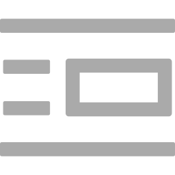

<!--  -->
<h2>   MinimalBlogger :pencil: </h2>
<!--  -->

 A Minimal Blogger as a desktop application, would you use it ?

Under development 🔃

## Development server
`
npm run go
`
 

Test Login Credentials
username: admin
password: 123456

 

### Technologies Used

